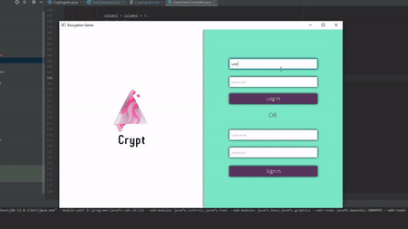

<h2>Cryptogram-Game</h2>

Cryptogram-Game is a game where the user has to decrypt encrypted phrases. The GUI is built using JavaFX and the backend is fully in java.

This game was developed as a submission for CS207(Advanced Programming) at the University Of Strathclyde.

<h2>Visuals</h2>

